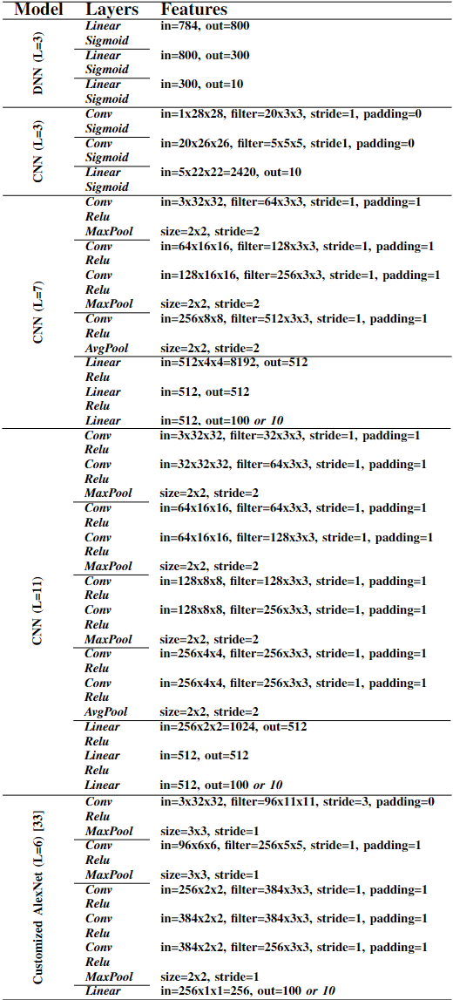

# semiMul
### Floating-Point Free Implementations for Efficient and Accurate Neural Network Training

*Accepted in ICMLA 2022 conference*

**Abstract** Multiply–accumulate operation (MAC) is a fundamental
component of machine learning tasks, where multiplication
(either integer or float multiplication) compared to addition is
costly in terms of hardware implementation or power consumption.
In this paper, we approximate floating-point multiplication by
converting it to integer addition while preserving the test accuracy
of shallow and deep neural networks. We mathematically show
and prove that our proposed method can be utilized with any
floating-point format (e.g., FP8, FP16, FP32, etc.). It is also highly
compatible with conventional hardware architectures and can be
employed in CPU, GPU, or ASIC accelerators for neural network
tasks with minimum hardware cost. Moreover, the proposed
method can be utilized in embedded processors without a floating point unit to perform neural network tasks. We evaluated our
method on various datasets such as MNIST, FashionMNIST,
SVHN, Cifar-10, and Cifar-100, with both FP16 and FP32
arithmetics. The proposed method preserves the test accuracy and,
in some cases, overcomes the overfitting problem and improves
the test accuracy.

This repository contains **official** implementation and source codes of semiMul paper.

### REQUIREMENTS 
- a GPU node
- CuPy  *used as the main core for implementing NN parts*
- numpy
- sklearn *for accuracy measurements*
- torchvision *for downloading datasets*

For using FP16 arithmetics, make sure that your GPU model satisfies: `__CUDA_ARCH__ >= 530`, otherwise, it **would not support** Half precision floating point operations and **would not compile** correctly.

### How to use

There are some example notebooks inside the example folder. Start by running them to get the same results as the paper. 

For testing different methods on a same model, load the proper header file in the first cell of the notebook according to this table:

|       | 32-Bit floating point (FP32) | 16-bit floating point (FP16) |
|-------|-----------------------|-----------------------|
|**Normal Multiplication**| `import util as util` `import NN0 as NN`|`import util16 as util` `import NN160 as NN`|
|**SemiMul method**|`import util as util` `import NN as NN`|`import util16 as util` `import NN16 as NN`|

You can also define your own model and simulate it.

The available modules for your model are:
- Linear
- Convolution (using im2col and col2im method)
- MaxPool and AvgPool
- Sigmoid, Relu, LRelu
- Reshape, Onehot
- MSE and Cross entropy Loss

All the class parameters are defined by CuPy to utilize GPU for computation insead of CPU.  
Do not run multiple simulations on one device simultaneously, because CuPy random initialization might fail and crash simulations.  
When tring to change parameters inside libraries be careful. For example, to change `TILE_DIM = 16` in your python code, you should also change: `#define TILE_DIM 16` in C++ code.  
If you had any questions do not hesitate to contact me(first author) :)
### License
Please feel free to use this repository. If you find this code useful in your research, please consider citing our paper:  
>Title: semiMul: Floating-Point Free Implementations -for Efficient and Accurate Neural Network Training
Authors: A. Nezhadi, S. Angizi, A. Roohi  
Conference: ICMLA 2022  

For other purposes (e.g. commercial purposes) please contact the authors beforehand.
